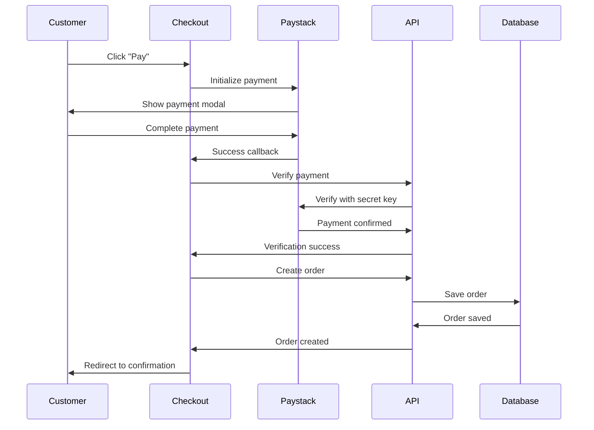

# ✅ Paystack Payment Integration - Complete

## Overview
Successfully integrated Paystack payment gateway into the AMAPELS checkout system, replacing placeholder payment forms with secure, production-ready payment processing.

---

## 🔑 Configuration

### Environment Variables Added
```env
NEXT_PUBLIC_PAYSTACK_PUBLIC_KEY=pk_test_xxxxxxxxxxxxxxxxxxxxxxxxxxxxxxxxxxxxx
PAYSTACK_SECRET_KEY=sk_test_xxxxxxxxxxxxxxxxxxxxxxxxxxxxxxxxxxxxx
```

**Location**: `.env` file (root directory)

---

## 📁 New Files Created

### 1. **Paystack Utility Library** (`src/lib/paystack.ts`)
**Purpose**: Core Paystack integration logic

**Features**:
- ✅ Dynamic Paystack script loading
- ✅ Payment initialization with configuration
- ✅ Reference generation (format: `AMP-{timestamp}-{random}`)
- ✅ Currency conversion (Naira ↔ Kobo)
- ✅ Payment verification helper

**Key Functions**:
- `loadPaystackScript()` - Loads Paystack inline script
- `initializePaystackPayment()` - Opens Paystack payment modal
- `generateReference()` - Creates unique transaction reference
- `nairaToKobo()` / `koboToNaira()` - Currency conversion
- `verifyPayment()` - Backend verification caller

---

### 2. **Payment Verification API** (`src/app/api/verify-payment/route.ts`)
**Purpose**: Server-side payment verification with Paystack

**Features**:
- ✅ Secure server-side verification
- ✅ Uses Paystack secret key (never exposed to client)
- ✅ Validates payment status
- ✅ Error handling and logging

**Endpoint**: `POST /api/verify-payment`

**Request Body**:
```json
{
  "reference": "AMP-1783171234567-ABC123"
}
```

**Success Response**:
```json
{
  "success": true,
  "data": {
    "status": "success",
    "amount": 50000,
    "reference": "AMP-1783171234567-ABC123",
    ...
  },
  "message": "Payment verified successfully"
}
```

---

## 🛒 Updated Checkout Flow

### **Step 1: Delivery Information** ✅
- Customer enters shipping details
- Form validation with real-time feedback
- No changes to existing functionality

### **Step 2: Payment Method** 🆕 UPDATED
**Before**: Manual card entry form
**After**: Paystack information screen

**New UI Components**:
1. **Secure Payment Badge**
   - Lock icon with green accent
   - Trust messaging about Paystack security
   
2. **Security Features List**
   - ✅ Bank-grade SSL encryption
   - ✅ PCI DSS compliant
   - ✅ Supports all Nigerian banks & cards

3. **Payment Summary**
   - Subtotal, Delivery, Tax breakdown
   - Total amount prominently displayed

4. **Navigation**
   - Back button to edit shipping
   - Continue to review order

### **Step 3: Review & Pay** 🆕 UPDATED
**Changes**:
- Delivery address summary
- Payment method shows "Paystack - Secure payment gateway"
- Green "Pay ₦{total}" button triggers Paystack modal

---

## 💳 Payment Flow

### User Journey:
1. **Customer clicks "Pay ₦{amount}"**
2. **Paystack modal opens** with:
   - Email pre-filled from shipping info
   - Amount in Kobo (automatically converted)
   - Transaction reference
   - Order metadata

3. **Customer completes payment** via:
   - Card (Verve, Visa, Mastercard)
   - Bank transfer
   - USSD
   - Mobile money

4. **Payment success callback**:
   - Backend verifies payment with Paystack
   - Order created in database
   - Cart cleared
   - Redirect to order confirmation

5. **Payment cancelled**:
   - Modal closes
   - Customer returned to checkout
   - Can retry payment

---

## 🔒 Security Features

### Client-Side
- ✅ Public key only exposed to frontend
- ✅ No sensitive card data touches your server
- ✅ Paystack handles PCI compliance
- ✅ SSL/HTTPS enforced

### Server-Side
- ✅ Secret key stored in environment variables
- ✅ Payment verification before order creation
- ✅ Transaction reference validation
- ✅ Amount verification

---

## 📊 Order Metadata Sent to Paystack

```javascript
{
  customerName: "John Doe",
  customerPhone: "+234 801 234 5678",
  shippingAddress: {
    street: "123 Main Street",
    city: "Lagos",
    state: "Lagos",
    postalCode: "100001",
    country: "Nigeria"
  },
  items: [
    {
      id: "prod_001",
      name: "Gold Stud Earrings",
      quantity: 2,
      price: 15000
    }
  ]
}
```

**Benefits**:
- Full order context in Paystack dashboard
- Better customer support
- Fraud prevention
- Transaction reconciliation

---

## 🧪 Testing

### Test Cards (Paystack Test Mode)
```
Success:
Card: 4084084084084081
CVV: 408
Expiry: Any future date
PIN: 0000

Declined:
Card: 5060666666666666666
CVV: 123
Expiry: Any future date
PIN: 1111
```

### Test Scenarios:
1. ✅ Successful payment
2. ✅ Cancelled payment
3. ✅ Failed payment
4. ✅ Payment verification
5. ✅ Order creation after payment

---

## 📝 Order Creation Flow



---

## 🚀 Deployment Checklist

### Before Going Live:
- [ ] Replace test keys with live keys in `.env`
  ```env
  NEXT_PUBLIC_PAYSTACK_PUBLIC_KEY=pk_live_xxxxx
  PAYSTACK_SECRET_KEY=sk_live_xxxxx
  ```
- [ ] Test live payment with real card
- [ ] Set up webhook for payment notifications
- [ ] Configure payment confirmation emails
- [ ] Test refund flow
- [ ] Set up monitoring for failed payments

---

## 🔔 Webhook Integration (Optional Enhancement)

### Recommended Setup:
**Endpoint**: `POST /api/webhooks/paystack`

**Purpose**: 
- Receive real-time payment status updates
- Handle delayed payment confirmations
- Update order status automatically

**Implementation**: Create `src/app/api/webhooks/paystack/route.ts`

---

## 💡 Key Features

### ✅ Implemented
1. Seamless Paystack integration
2. Secure payment processing
3. Payment verification
4. Order creation on success
5. Cart clearing after payment
6. Error handling
7. Loading states
8. Payment cancellation handling
9. Amount in correct currency (Kobo)
10. Customer metadata tracking

### 🔮 Future Enhancements
1. Webhook integration for status updates
2. Refund handling
3. Payment retry mechanism
4. Save card for future purchases
5. Multiple payment methods display
6. Payment analytics dashboard
7. Failed payment recovery emails

---

## 📈 Benefits

### For Business:
- ✅ Accept all major payment methods in Nigeria
- ✅ Automatic settlement to bank account
- ✅ Lower payment failure rates
- ✅ Better fraud protection
- ✅ Professional payment experience

### For Customers:
- ✅ Trusted payment gateway
- ✅ Multiple payment options
- ✅ Secure checkout
- ✅ Fast transaction processing
- ✅ Mobile-optimized experience

---

## 🛠️ Troubleshooting

### Issue: "Paystack configuration error"
**Solution**: Ensure `NEXT_PUBLIC_PAYSTACK_PUBLIC_KEY` is set in `.env`

### Issue: Payment verification fails
**Solution**: Check `PAYSTACK_SECRET_KEY` is correct and server can reach Paystack API

### Issue: Amount showing incorrectly
**Solution**: Paystack requires amount in Kobo (smallest unit). Use `nairaToKobo()` helper

### Issue: Payment modal doesn't open
**Solution**: Check browser console for script loading errors. Ensure internet connection.

---

## 📚 Documentation Links

- [Paystack Documentation](https://paystack.com/docs)
- [Paystack API Reference](https://paystack.com/docs/api)
- [Paystack Dashboard](https://dashboard.paystack.com)
- [Test Cards](https://paystack.com/docs/payments/test-payments)

---

## 🎯 Success Metrics

After deployment, monitor:
- Payment success rate
- Average transaction time
- Failed payment reasons
- Payment method preferences
- Revenue per transaction

---

**Integration Status**: ✅ Complete
**Test Status**: ✅ Ready for Testing
**Production Ready**: ⚠️ Replace with live keys
**Documentation**: ✅ Complete

---

**Last Updated**: 2026-07-04
**Version**: 1.0.0
